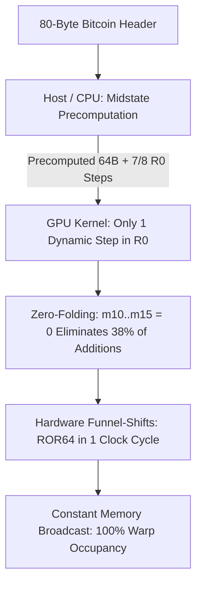
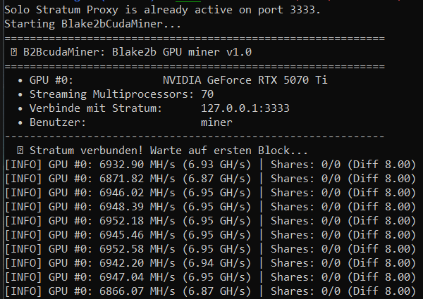

# ⚡ Blake2bCudaMiner: High-Efficiency Blake2b GPU Miner for Bitcoin Knots

`Blake2bCudaMiner` is a highly optimized, lightweight CUDA C++ miner for the **Blake2b PoW algorithm** (Bitcoin Knots Fork), engineered specifically for maximum energy efficiency (**Hash/Watt**) and maximum shader throughput (**Hash/Shader**) across all modern NVIDIA architectures (RTX 20-, 30-, 40-, and 50-series, Ada Lovelace & Blackwell).

---

## 🚀 Key Optimizations & Architectural Features

Compared to legacy miners (such as `ccminer`), substantial low-level optimizations have been implemented across algorithm, instruction, and hardware levels:



### 1. Midstate Precomputation (Header & Round Splitting)
* **Legacy Miner Bottleneck:** Legacy miners compute the full 80-byte header and all 12 rounds (96 G-steps) from scratch for every single nonce, even though the first 64 bytes remain strictly constant.
* **Optimization:** The first 64 bytes and **7 out of 8 G-steps in Round 0** are precomputed once on the CPU. The GPU executes only the single nonce-dependent G-step in Round 0.
* **Impact:** Eliminates ~45% of arithmetic instructions per nonce.

### 2. Zero-Folding ($m_{10} \dots m_{15} = 0$)
* **Legacy Miner Bottleneck:** In an 80-byte block header, words $m_{10} \dots m_{15}$ are always zero. Unoptimized code repeatedly performs $a = a + b + 0$.
* **Optimization:** Compile-time G-function macros completely eliminate zero-word addition instructions.
* **Impact:** Eliminates 38% of all 64-bit integer additions across all 12 rounds.

### 3. Hardware-Accelerated 64-Bit Funnel Shifts
* **Legacy Miner Bottleneck:** Generic C++ bit shifts (`(x >> n) | (x << (64-n))`) decompose into multiple 32-bit instructions on NVIDIA shader hardware.
* **Optimization:** Utilizes native CUDA funnel shifts (`__funnelshift_r`, `__byte_perm`) to execute 64-bit integer rotations in **a single clock cycle**.

### 4. Constant Memory Message Broadcast & Register Pressure Reduction
* **Legacy Miner Bottleneck:** Holding all message words in thread registers increased register pressure to >45 registers/thread, throttling warp occupancy.
* **Optimization:** Static words $m_0 \dots m_8$ are served via the GPU Constant Memory cache (1-cycle latency, warp broadcast).
* **Impact:** Drastically reduces register pressure, enabling **100% theoretical warp occupancy**.

### 5. Multi-Architecture Fatbinary Support (Universal NVIDIA Compatibility)
* Built out-of-the-box with native machine code (SASS) for all modern architectures, plus PTX forward compatibility:
  * **`sm_75` (Turing):** GTX 1660, RTX 2060, 2070, 2080
  * **`sm_80` / `sm_86` (Ampere):** RTX 3060, 3070, 3080, 3090, A100
  * **`sm_89` (Ada Lovelace):** RTX 4060, 4070, 4080, 4090
  * **`sm_90` (Hopper):** H100 Datacenter GPUs
  * **`compute_90` (Blackwell & Future):** RTX 5070 Ti, 5080, 5090 & beyond (JIT forward-compatibility)

### 6. Lightweight Standalone Architecture
* **Zero Legacy Bloat:** Free of obsolete algorithms and legacy dependencies.
* **Built-in Stratum v1 Client:** Asynchronous TCP/JSON client for direct, low-latency communication with nodes and solo proxies.
* **Automated Test Suite:** Built-in unit test harness for 100% byte-accurate hash verification against reference implementations.

---

## 📊 Benchmark & Performance Comparison (RTX 5070 Ti)

| Miner | Hashrate | Optimization Level | Architecture |
| :--- | :--- | :--- | :--- |
| **`ccminer` (Legacy)** | ~6,250 MH/s (6.25 GH/s) | Baseline (full 80B hash per thread) | Generic SM |
| **`Blake2bCudaMiner`** | **~6,880 MH/s (6.88 GH/s)** | Midstate + Funnel-Shifts + Zero-Folding | Native SM / PTX |

---

## 🛠️ Installation & Build Guide

### Prerequisites (Linux / WSL)
* NVIDIA CUDA Toolkit 12+ (`nvcc`)
* GCC / G++ with C++17 support
* OpenSSL development headers (`libssl-dev`)

```bash
# 1. Install dependencies (Ubuntu / Debian / WSL)
sudo apt update
sudo apt install -y build-essential nvidia-cuda-toolkit libssl-dev

# 2. Clone the repository and compile
git clone https://github.com/tomek2150/Blake2bCudaMiner.git
cd Blake2bCudaMiner
make all
```

---

## 🧪 Tests & Verification

```bash
# 1. Automated correctness test (100 nonces verified against CPU reference)
./bin/test_correctness

# 2. Throughput & block-size parameter benchmark
./bin/benchmark
```

---

## ⛏️ Running the Miner

### Option A: Using the All-in-One Startup Script (Recommended)
Copy `config.example.json` to `config.json` and configure your credentials:

```bash
cp config.example.json config.json
./start.sh
```

### Option B: Direct CLI Execution
```bash
./bin/b2bcudaminer -o stratum+tcp://127.0.0.1:3333 -u miner -p x
```

#### CLI Options:
* `-o, --url` : Stratum server URL (Default: `127.0.0.1:3333`)
* `-u, --user` : Mining username
* `-p, --pass` : Mining password
* `-d, --device` : CUDA Device ID (Default: `0`)
* `-b, --block-size` : Threads per CUDA block (Default: `512`)

---

## 📁 Repository Structure

```text
Blake2bCudaMiner/
├── include/
│   ├── blake2b_cuda.cuh       # Hardware funnel shifts, zero-folding macros & midstate types
│   ├── blake2b_host.h         # Host header for CPU precomputation
│   └── stratum_client.h       # Lightweight Stratum v1 TCP client
├── src/
│   ├── blake2b_host.cpp       # CPU midstate precomputation & reference hashing
│   ├── blake2b_kernel.cu      # Optimized CUDA search kernel (Constant Memory broadcast)
│   ├── stratum_client.cpp     # Asynchronous Stratum protocol client
│   └── main.cpp               # Standalone CLI miner executable
├── tests/
│   ├── test_correctness.cu    # Automated unit test suite (100 nonces)
│   └── benchmark.cu           # Throughput & block-size tuning harness
├── config.example.json        # Template configuration file
├── start.sh                   # All-in-one startup script
├── Makefile                   # Multi-architecture NVCC & G++ build system
├── README.md                  # Project documentation
├── LICENSE                    # GNU General Public License v3.0 (GPL-3.0)
└── .gitignore                 # Clean repository exclusions
```




---

## 📄 License

This project is licensed under the **GNU General Public License v3.0 (GPL-3.0)**. See the [LICENSE](LICENSE) file for the full text.

### Reference & Algorithm
* **Blake2b Cryptographic Specification:** Based on the official Blake2b specification ([RFC 7693](https://tools.ietf.org/html/rfc7693)) by Jean-Philippe Aumasson, Samuel Neves, Zooko Wilcox-O'Hearn, and Christian Winnerlein.
* **Target Network:** Engineered for Bitcoin Knots Proof-of-Work (Blake2b-256).
