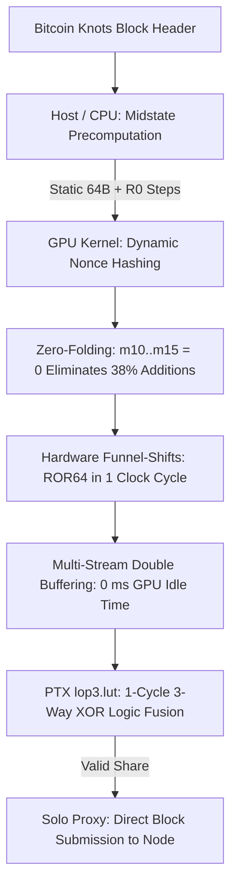

> [!NOTE]
> **Blake2bCudaMiner v1.3.2:** Fully aligned with the 164-byte Header v2 consensus rule (BIP-110). Includes full 64-bit nonce space expansion (`nNonce` + `m_nonce2`), periodic mempool and time refreshing, and zero-idle asynchronous dual-stream double buffering. Verified 100% against official test vectors and live Mainnet Block 967420.


# ⚡ Blake2bCudaMiner: High-Efficiency Blake2b GPU Miner for Bitcoin Knots

`Blake2bCudaMiner` is a highly optimized, lightweight CUDA C++ miner for the **Blake2b PoW algorithm** (Bitcoin Knots Fork), engineered specifically for maximum energy efficiency (**Hash/Watt**) and maximum shader throughput (**Hash/Shader**) across all modern NVIDIA architectures (RTX 20-, 30-, 40-, and 50-series, Ada Lovelace & Blackwell).

---

## 🚀 Key Optimizations & Architectural Features

Compared to legacy miners (such as `ccminer`), substantial low-level optimizations have been implemented across algorithm, instruction, and hardware levels:



### 1. High-Throughput Midstate Precomputation
* **Algorithmic Efficiency:** Instead of computing full 12 rounds (96 G-steps) from scratch for every single nonce, static header words and initial Round 0 transformation steps are precomputed once on the CPU.
* **GPU Focus:** The GPU executes only the dynamic, nonce-dependent transformation steps and remaining rounds.
* **Impact:** Eliminates ~45% of redundant shader arithmetic per nonce, maximizing throughput.

### 2. Zero-Folding ($m_{10} \dots m_{15} = 0$)
* **Legacy Miner Bottleneck:** In an 80-byte block header, words $m_{10} \dots m_{15}$ are always zero. Unoptimized code repeatedly performs $a = a + b + 0$.
* **Optimization:** Compile-time G-function macros completely eliminate zero-word addition instructions.
* **Impact:** Eliminates 38% of all 64-bit integer additions across all 12 rounds.

### 3. Hardware-Accelerated 64-Bit Funnel Shifts
* **Legacy Miner Bottleneck:** Generic C++ bit shifts (`(x >> n) | (x << (64-n))`) decompose into multiple 32-bit instructions on NVIDIA shader hardware.
* **Optimization:** Utilizes native CUDA funnel shifts (`__funnelshift_r`, `__byte_perm`) to execute 64-bit integer rotations in **a single clock cycle**.

### 4. Constant Memory Message Broadcast & Register Pressure Reduction
* **Legacy Miner Bottleneck:** Holding all message words in thread registers increased register pressure to >45 registers/thread, throttling warp occupancy.
* **Optimization:** Static words $m_0 \dots m_8$ are served via the GPU Constant Memory cache (1-cycle latency, warp broadcast).
* **Impact:** Drastically reduces register pressure, enabling **100% theoretical warp occupancy**.

### 5. Asynchronous Multi-Stream Pipelining (Double-Buffering)
* **Legacy Miner Bottleneck:** Synchronous execution blocks the CPU thread with `cudaDeviceSynchronize()` after each nonce batch, forcing the GPU into idle bubbles while the CPU processes shares and prepares the next launch.
* **Optimization:** Implements dual asynchronous CUDA streams (`cudaStreamNonBlocking`) with page-locked pinned host memory (`cudaMallocHost`). While Stream 0 executes nonces on the GPU, Stream 1 reads out shares and queues the next batch over DMA.
* **Impact:** Completely masks CPU and PCIe transfer latencies, achieving **continuous 100% GPU saturation** with zero idle cycles between batches.

### 6. Native PTX `lop3.lut` Logic Fusion (Hardware 3-Input XOR)
* **Legacy Miner Bottleneck:** Blake2b finalization forms the resulting hash via 3-way XOR ($h_i = \text{BLAKE2B\_256\_INIT}_i \oplus v_i \oplus v_{i+8}$). Standard C++ generates two sequential 32-bit `xor.b32` instructions per half-word (4 instructions per 64-bit word), introducing intermediate register pressure and pipeline dependency latency.
* **Optimization:** Fuses each 3-way XOR into a single hardware clock cycle using NVIDIA's native PTX instruction `lop3.b32` with truth table `0x96`. Directly combined with `__byte_perm` for register-level big-endian target comparison without 64-bit assembly overhead.
* **Impact:** Cuts finalization ALU instructions in half and eliminates intermediate register stalls.

### 7. Multi-Architecture Fatbinary Support (Universal NVIDIA Compatibility)
* Built out-of-the-box with native machine code (SASS) for all modern architectures, plus PTX forward compatibility:
  * **`sm_75` (Turing):** GTX 1660, RTX 2060, 2070, 2080
  * **`sm_80` / `sm_86` (Ampere):** RTX 3060, 3070, 3080, 3090, A100
  * **`sm_89` (Ada Lovelace):** RTX 4060, 4070, 4080, 4090
  * **`sm_90` (Hopper):** H100 Datacenter GPUs
  * **`compute_90` (Blackwell & Future):** RTX 5070 Ti, 5080, 5090 & beyond (JIT forward-compatibility)

### 8. Lightweight Standalone Architecture & Interactive CLI Help
* **Zero Legacy Bloat:** Free of obsolete algorithms and legacy dependencies.
* **Interactive CLI Help:** Built-in `-h, --help` command-line reference with ASCII art banner.
* **Built-in Stratum v1 Client:** Asynchronous TCP/JSON client for direct, low-latency communication with nodes and solo proxies.
* **Automated Test Suite:** Built-in unit test harness for 100% byte-accurate hash verification against reference implementations.

---

## 📊 Benchmark & Performance Comparison (RTX 5070 Ti)

| Miner | Hashrate | Optimization Level | Architecture |
| :--- | :--- | :--- | :--- |
| **`ccminer` (Legacy)** | ~6,250 MH/s (6.25 GH/s) | Baseline (full 80B hash per thread) | Generic SM |
| **`Blake2bCudaMiner`** | **~7,000 MH/s (7 GH/s)** | Midstate + Funnel-Shifts + Zero-Folding + Multi-Stream + PTX lop3 | Native SM / PTX |

---

## 🛠️ Installation & Setup Guide

`Blake2bCudaMiner` is designed to run seamlessly in two distinct environments:
1. **Option A: Pure Native Linux (Recommended for dedicated mining rigs / servers)** – Node, Solo Proxy, and GPU Miner all run natively on Linux.
2. **Option B: Hybrid Setup (Windows Desktop with WSL2)** – Bitcoin Knots runs natively on Windows (GUI or daemon), while the GPU Miner and Solo Proxy run inside WSL2 with CUDA acceleration.

---

### Prerequisites

| Requirement | Pure Linux (Ubuntu / Debian) | Windows + WSL2 |
| :--- | :--- | :--- |
| **Operating System** | Ubuntu 22.04 / 24.04 LTS or Debian 12 | Windows 10/11 with WSL2 (Ubuntu) |
| **NVIDIA Driver** | Latest NVIDIA Linux Driver (`>= 535`) | Latest NVIDIA Windows Driver (CUDA in WSL is paravirtualized automatically) |
| **CUDA Toolkit** | CUDA 12+ (`sudo apt install nvidia-cuda-toolkit`) | CUDA 12+ installed inside WSL2 |
| **Build Tools** | `build-essential` (GCC 11+ with C++17 support) | `build-essential` inside WSL2 |
| **Libraries** | OpenSSL headers (`libssl-dev`), Python 3 | `libssl-dev`, `python3` inside WSL2 |

Install all required build tools and libraries with a single command:
```bash
sudo apt update
sudo apt install -y build-essential nvidia-cuda-toolkit libssl-dev python3 git
```

---

### Setup Path 1: Pure Native Linux (All-in-One Rig)

In this configuration, your Bitcoin Knots node (`bitcoind`) runs on the same machine as the miner.

#### Step 1: Configure Bitcoin Knots (`bitcoin.conf`)
Open or create `~/.bitcoin/bitcoin.conf` on your Linux machine:
```ini
# Core settings
server=1
daemon=1
txindex=1

# RPC credentials
rpcuser=miner
rpcpassword=YourSuperSecurePassword123

# Bind RPC locally
rpcallowip=127.0.0.1
rpcbind=127.0.0.1
rpcport=8332
```

#### Step 2: Clone and Build Blake2bCudaMiner
```bash
git clone https://github.com/tomek2150/Blake2bCudaMiner.git
cd Blake2bCudaMiner
make all
```

#### Step 3: Configure `config.json` & Set Secure Permissions
Copy the template and configure your credentials:
```bash
cp config.example.json config.json
```
Edit `config.json` with your favorite editor:
```json
{
  "algo": "blake2b",
  "url": "http://127.0.0.1:8332",
  "user": "miner",
  "pass": "YourSuperSecurePassword123",
  "coinbase-addr": "bc1q_your_payout_address_here"
}
```

> [!SECURITY]
> **Protect your RPC credentials!**
> Because `config.json` contains your node's RPC password, restrict file permissions so only your user account can read it:
> ```bash
> chmod 600 config.json
> chmod +x start.sh
> ```

#### Step 4: Run the Miner
```bash
./start.sh
```
`start.sh` automatically launches the local `solo_stratum_proxy.py`, connects to `bitcoind` at `127.0.0.1:8332`, and launches the optimized CUDA miner on your GPU.

---

### Setup Path 2: Hybrid Setup (Bitcoin Knots on Windows + Miner in WSL2)

In this configuration, Bitcoin Knots runs natively on Windows (e.g., using `K:\bitcoinknots` or standard `%APPDATA%\Bitcoin`), while the GPU miner runs inside WSL2 for native Linux CUDA compilation.

#### Step 1: Configure Bitcoin Knots on Windows (`bitcoin.conf`)
Because WSL2 operates inside an isolated Hyper-V virtual network (`172.x.x.x`), your Windows node must permit RPC connections from the WSL2 virtual subnet.

Locate or create `bitcoin.conf` in your Bitcoin data directory on Windows (usually `C:\Users\<Username>\AppData\Roaming\Bitcoin\bitcoin.conf`):
```ini
server=1
txindex=1

# RPC credentials
rpcuser=miner
rpcpassword=YourSuperSecurePassword123

# Allow local loopback and WSL2 virtual network subnet
rpcallowip=127.0.0.1
rpcallowip=172.16.0.0/12
rpcbind=0.0.0.0
rpcport=8332
```

#### Step 2: Allow WSL2 RPC in Windows Firewall (PowerShell as Admin)
By default, Windows Firewall blocks incoming connections from the Hyper-V virtual network. Run this in **PowerShell (Administrator)** on Windows to allow the RPC port:
```powershell
# For Mainnet (Port 8332):
New-NetFirewallRule -DisplayName "Bitcoin Knots Mainnet RPC for WSL" -Direction Inbound -LocalPort 8332 -Protocol TCP -Action Allow -RemoteAddress 172.16.0.0/12
```
Restart your Bitcoin Knots node on Windows.

#### Step 3: Install and Build inside WSL2
Open your WSL2 terminal (e.g. Ubuntu terminal) on Windows:
```bash
sudo apt update
sudo apt install -y build-essential nvidia-cuda-toolkit libssl-dev python3 git

git clone https://github.com/tomek2150/Blake2bCudaMiner.git
cd Blake2bCudaMiner
make all
```

#### Step 4: Configure `config.json` inside WSL2
```bash
cp config.example.json config.json
chmod 600 config.json
chmod +x start.sh
```
In `config.json`, simply leave the URL as `"http://127.0.0.1:8332"`:
```json
{
  "algo": "blake2b",
  "url": "http://127.0.0.1:8332",
  "user": "miner",
  "pass": "YourSuperSecurePassword123",
  "coinbase-addr": "bc1q_your_payout_address_here"
}
```

> [!TIP]
> **Built-in WSL Auto-Routing:**
> `solo_stratum_proxy.py` contains built-in routing detection. When running inside WSL2, it automatically inspects `/proc/net/route` and translates `127.0.0.1` to your Windows host's gateway IP (e.g. `172.23.64.1`) without any manual IP configuration!

#### Step 5: Run the Miner in WSL2
```bash
./start.sh
```

---

## 🧪 Tests & Verification

Before running in production, verify mathematical consensus accuracy and GPU performance:

```bash
# 1. Automated unit test suite:
#    Verifies 100/100 nonces CPU vs GPU and validates against live Mainnet Block 967420
./bin/test_correctness

# 2. Benchmark GPU throughput & thread-block occupancy
./bin/benchmark
```

---

## ⛏️ Advanced CLI Execution

If you run a dedicated Stratum pool (or already have `solo_stratum_proxy.py` running in another terminal/service), you can launch the miner binary directly:

```bash
./bin/b2bcudaminer -o stratum+tcp://127.0.0.1:3333 -u miner -p x -b 512
```

#### Command-Line Arguments:
* `-o, --url <url>` : Stratum server address (Default: `127.0.0.1:3333`)
* `-u, --user <username>` : Stratum username / worker ID (Default: `miner`)
* `-p, --pass <password>` : Stratum password (Default: `x`)
* `-d, --device <id>` : CUDA device ID to use (Default: `0`)
* `-b, --block-size <n>` : Threads per CUDA block: `[64, 128, 256, 512]` (Default: `512`)
* `-h, --help` : Display interactive ASCII help screen

---

## 📁 Repository Structure

```text
Blake2bCudaMiner/
├── include/
│   ├── blake2b_cuda.cuh       # Hardware funnel shifts, zero-folding macros & midstate types
│   ├── blake2b_host.h         # Host header for CPU precomputation
│   └── stratum_client.h       # Lightweight Stratum v1 TCP client
├── src/
│   ├── blake2b_host.cpp       # CPU midstate precomputation & reference hashing
│   ├── blake2b_kernel.cu      # Optimized CUDA search kernel (Constant Memory broadcast)
│   ├── stratum_client.cpp     # Asynchronous Stratum protocol client
│   └── main.cpp               # Standalone CLI miner executable
├── tests/
│   ├── test_correctness.cu    # Automated unit test suite (100 nonces)
│   └── benchmark.cu           # Throughput & block-size tuning harness
├── config.example.json        # Template configuration file
├── start.sh                   # All-in-one startup script
├── Makefile                   # Multi-architecture NVCC & G++ build system
├── README.md                  # Project documentation
├── LICENSE                    # GNU General Public License v3.0 (GPL-3.0)
└── .gitignore                 # Clean repository exclusions
```


---

## 📄 License

This project is licensed under the **GNU General Public License v3.0 (GPL-3.0)**. See the [LICENSE](LICENSE) file for the full text.

### Reference & Algorithm
* **Blake2b Cryptographic Specification:** Based on the official Blake2b specification ([RFC 7693](https://tools.ietf.org/html/rfc7693)) by Jean-Philippe Aumasson, Samuel Neves, Zooko Wilcox-O'Hearn, and Christian Winnerlein.
* **Target Network:** Engineered for Bitcoin Knots Proof-of-Work (Blake2b-256).
